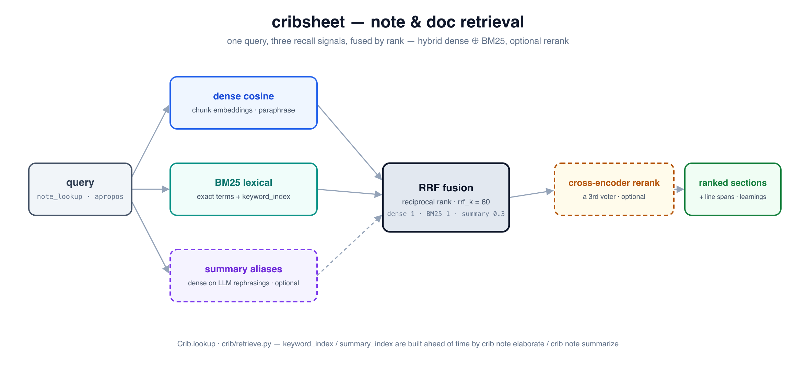

# cribsheet — design

A local MCP server that manages a tree of markdown notes as long-term memory,
indexed for semantic retrieval by a Chroma embedding store. Markdown on disk is
the source of truth; Chroma is a derived, rebuildable cache. Inspired by
basic-memory, but content-addressable via embeddings rather than a knowledge
graph.

`crib` = binary / command. `cribsheet` = the project.

---

## 1. Core principles

1. **Disk is truth, Chroma is a cache.** Notes are plain markdown (optional YAML
   frontmatter). The index can always be deleted and rebuilt from disk.
2. **One path to the index.** Every write — tool, file watcher, or direct LLM
   edit — funnels through a single `index_file(path)` routine that is
   **idempotent and content-hash-gated** and wrapped in a **per-path lock**.
   This is the central design decision; everything else leans on it.
3. **Correctness never depends on event timing.** Because `index_file` no-ops
   when the content hash is unchanged, racing writers and noisy/duplicated
   filesystem events degrade to redundant work, never a wrong index.
4. **Model-agnostic.** The server holds no API keys for generation. `distill`
   uses MCP sampling so the *client's* current LLM does the work.

---

## 2. Storage layout (XDG, three lifecycles)

Three categories of state with different lifecycles get three roots:

| What | Default | Env override | Git? | Lifecycle |
|---|---|---|---|---|
| **Config** — `config.toml`, default embed model, distill prompt | `$XDG_CONFIG_HOME/crib` → `~/.config/crib` | `CRIB_CONFIG_DIR` | optional | hand-edited |
| **Data (truth)** — `projects/<name>/notes/**.md`, `.cribproject` | `$XDG_DATA_HOME/crib` → `~/.local/share/crib` | `CRIB_DATA_DIR` | **auto-detect** | precious |
| **Index (derived)** — Chroma persistent dir | `$XDG_CACHE_HOME/crib` → `~/.cache/crib` | `CRIB_INDEX_DIR` | **never** | disposable |

Per-dir resolution precedence: explicit env var → `XDG_*` → `~/.{config,local/share,cache}/crib`.

Chroma lives under **cache** on purpose:
- `rm -rf $CRIB_INDEX_DIR && crib reindex --all` is a supported recovery path.
- It is physically impossible to accidentally git the embeddings — they are not
  in the data tree.

### On-disk shape

```
$CRIB_CONFIG_DIR/
  config.toml                 # global defaults

$CRIB_DATA_DIR/
  projects/
    <project>/
      .cribproject            # project config (see §6)
      notes/…/*.md            # arbitrary subdir tree for organization
  .versions/                  # per-write version ring (see §8); git-ignored
  .git/                       # optional, auto-detected; backs the data tree only

$CRIB_INDEX_DIR/
  chroma/                     # persistent Chroma client dir
```

---

## 3. Data model

### Note file

Markdown + optional YAML frontmatter:

```markdown
---
id: 01J…              # ULID, stable across renames; assigned on first index
title: …
tags: [x, y]
created: 2026-06-27
updated: 2026-06-27
source: manual|appended|distilled
---
## Section A
body…
```

`id` makes renames non-destructive: identity follows the note, not its path. On
rename the old `relpath` chunks are deleted and re-inserted under the new path
without losing the logical identity.

### Chunking — per-heading + windowed fallback

- Split on markdown headings (`#`–`######`); each section is one chunk, carrying
  `heading_path` (e.g. `["A"]` or nested `["A","A.1"]`).
- A section over ~512 tokens → sliding-window sub-chunks with overlap.
- Headingless / frontmatter-only notes → whole body, windowed if long.

### Chunk identity & Chroma metadata

Single collection `crib_chunks`, filtered by `project` metadata.

```
chunk_id     = sha1(project + relpath + heading_path + window_idx)
content_hash = sha1(chunk_text)        # the coordination gate
metadata     = {project, relpath, note_id, title, tags,
                heading_path, window_idx, file_mtime, source}
```

Incremental reindex of a file: recompute its chunk set → upsert chunks whose
`content_hash` changed → delete `chunk_id`s no longer present.

---

## 4. The coordination model (writer ⇄ watcher)

Tools index **synchronously**, and a file watcher also reindexes. The naive
version races: a tool writes a file, begins embedding (~tens of ms), and the
watcher fires mid-window and re-embeds the same content.

Resolved by making **content-hash gating the single coordination mechanism**:

- Every chunk stores `content_hash`.
- The one-and-only `index_file(path)` is idempotent and hash-gated: compute the
  current file hash; if it matches stored hashes, no-op and return.
- `index_file` is wrapped in a **per-path async lock**.

Resulting flows, race-free with no echo-tracking state:

1. **Tool write** — write F → `index_file(F)` → lock → embed → upsert new
   hashes → release.
2. **Watcher echo** — fires for F → `index_file(F)` → waits on lock → re-reads
   hash → matches → no-op.
3. **External / direct-LLM edit** — watcher fires → hash differs → reindex.

The "tag the file so the watcher skips its echo" requirement *is* the stored
hash. No tagging, no shared mutable set, no feedback loop with `distill`.

---

## 5. Tool surface

The interface is **noun-verb**: on the CLI, `crib <noun> <verb>` (`note`/`code`/
`learning`/`project`); as MCP tools, the flat noun-prefixed name (`note_lookup`,
`code_xref`, `learning_add`, `project_list`). Below is the **note** facet — the
original memory surface; the code-index, learnings, and project facets are in
[docs/code-symbol-index.md](docs/code-symbol-index.md), and the complete
CLI⇄MCP reference is [docs/surface.md](docs/surface.md). The write verbs are kept
distinct (`store`/`append`/`edit`) so the LLM selects correctly; every write ends
by calling the locked `index_file`.

| MCP tool (CLI: `crib note …`) | Purpose | Writes? | Indexes? |
|---|---|---|---|
| `note_lookup(query, project?, k?, tags?)` | semantic search; ranked chunks w/ relpath, heading, snippet; optional dedupe-by-file | no | reads |
| `note_read(relpath, project?)` | fetch raw note for the LLM to reason over / rewrite | no | no |
| `note_locate(relpath, project?) → abs_path` | return the real on-disk path so the LLM edits with its own file tools | no | no |
| `note_store(content, title?, project?, tags?)` | create a new note; assign `id`; write; index | yes | sync |
| `note_append(relpath, content, heading?)` | add to an existing note / under a heading | yes | sync |
| `note_edit(relpath, new_content)` | replace raw file content (LLM-driven rewrite) | yes | sync |
| `note_reindex(relpath | project | --all)` | re-run hash-gated `index_file`; safe to call redundantly | no | sync |
| `note_distill(project?, relpath?)` | re-digest via the generation layer: compress, merge dups, normalize frontmatter | yes | sync |
| `note_versions(relpath, project?)` | list per-write versions (timestamps) held in the ring | no | no |
| `note_restore(relpath, version, project?)` | restore a prior version (itself a write → new ring entry) | yes | sync |
| `note_import(project?, cwd?)` | ingest local docs referenced by a code repo's `.crib` into the project | yes | sync |
| `note_snapshot(message?)` | explicit git checkpoint of the data tree (no-op if not a git repo) | (git) | no |
| `note_history(relpath)` | surface a note's commit log | no | no |
| `project_list()` | list projects (each a separate memory namespace) | no | no |

### Retrieval loop

`note_lookup` (find) → `note_read` or `note_locate` (pull full context) → `note_edit`
or native edit → (`note_reindex`, optional). `note_lookup` returns sections, not
whole files, so the LLM sees precisely the relevant chunk.

### Direct-edit pattern

`locate` returns the absolute path; the LLM edits it with its own file tools.
`reindex`'s description doubles as the post-edit instruction: *"Call immediately
after editing a note via its raw path so changes are searchable now. Safe to
call redundantly — it no-ops if already current."* The watcher would catch the
edit after debounce regardless; `reindex` just removes the latency.

---

## 6. Project association — `.crib` and `.cribproject`

**`.cribproject`** — lives in a crib project's data dir; project-level config:

```yaml
name: cribsheet
embed_model: bge-small-en-v1.5
distill_prompt: |
  …
versions_keep: 20         # ring depth (see §8); 0 disables
```

Projects always live under `$CRIB_DATA_DIR/projects/<name>/notes`; there is no
arbitrary project path. Organization happens through arbitrary subdir trees
*within* a project. Git is not configured here — it is auto-detected from the
presence of `.git` in the data root (see §8).

**`.crib`** — tiny YAML at a *code repo* root. Two jobs: associate the repo with
a crib project, and declare local docs to import into it.

```yaml
project: cribsheet        # which crib project this code maps to
paths: [docs, notes]      # optional: subtree scope within the crib project for lookup
import:                   # optional: local docs to ingest via `import` (globs, repo-relative)
  - docs/**/*.md
  - README.md
import_into: imported/    # optional: subdir within the project to land imports (default: imported/<repo>/)
```

**Project resolution precedence** on any tool call: explicit `project` arg →
`.crib` found by walking up from `cwd` → default project.

### Import semantics

`import` reads the `.crib` in (or above) `cwd`, expands its `import` globs against
the repo, and **copies** each matched doc into the project under `import_into`
(default `imported/<repo>/`, preserving relative structure). It is a one-way
**pull from source**: the central store is truth once imported, and re-running
`import` overwrites the imported copies from source (source wins on re-import).
Provenance is recorded in frontmatter:

```yaml
source: imported
source_repo: /abs/path/to/repo
source_path: docs/architecture.md
imported: 2026-06-27
```

Imported notes index and behave like any other note. Editing an imported copy in
the crib store is allowed, but a later `note import` re-pull overwrites it — provenance
makes that visible so the LLM can warn before clobbering local edits. (Whether to
ever push edits *back* to the source repo is deliberately out of scope — see §11.)

---

## 7. distill

On-demand only — **never on write** (that is exactly where a watcher feedback
loop would form). Given a note or whole project, it reads raw markdown, runs it
through an LLM with the project's `distill_prompt`, and writes back a
compressed/normalized version with `source: distilled`. Because it only writes
files, it flows through the same locked `index_file` — no special casing. Writes
only when the distilled output's hash differs (thrash guard).

> **Realized on llmkit's `bridge`, not MCP sampling.** See
> [docs/knowledge-capture.md](docs/knowledge-capture.md) — the generation layer
> (bridge wrapper + `claude_code` no-key adapter) shared with §12's conversation
> capture. The bridge works from the CLI/daemon/hooks where no MCP sampling client
> exists.

---

## 8. Versioning (two layers, neither indexed)

Recovery is two complementary layers. Neither is surfaced in the Chroma index —
both are reachable only via tools.

### Layer 1 — per-write version ring (automatic)

Every write (`store` overwriting, `append`, `edit`, `restore`, `distill`,
`import` re-pull) first stashes the *prior* file content into the ring before
writing the new content. The ring keeps the last N versions per note
(`versions_keep`, default 20; 0 disables).

- Stored under `$CRIB_DATA_DIR/.versions/<note_id>/<seq>-<short_hash>.md`, keyed
  by note `id` so it survives renames. Git-ignored; outside `notes/`, so never
  indexed and never surfaced in `lookup`.
- `versions(relpath)` lists entries; `restore(relpath, version)` writes a chosen
  prior version back (which itself stashes the current content as a new ring
  entry — restore is non-destructive and itself undoable).
- This is the fine-grained "I just clobbered a note" safety net that exists
  *between* snapshots, independent of whether git is set up at all.

### Layer 2 — git checkpoints (manual, auto-detected)

Git is **not configured** in `.cribproject`. It is **auto-detected**: if the data
root contains `.git`, git features activate; otherwise they are inert. The data
root is self-contained with **no Chroma inside it**, so git just works.

- **No commit-on-write, and no option for it.** Per-edit commits are never
  offered — they would be noise. Commits happen only on explicit `snapshot`.
- `snapshot(message?)` — stage the data tree and commit (no-op if not a git
  repo). `history(relpath)` — that note's commit log.
- The watcher and git both ignore `.git/` and `.versions/`.

---

## 9. File watcher (macOS + Linux)

`watchdog` abstracts the backend (FSEvents on macOS, inotify on Linux). The
cross-platform trap: **editors don't emit `modified`** — vim, VS Code, and most
"atomic save" editors write a temp file and `rename()` over the target, so you
see `created` + `moved`, ordered/coalesced differently per backend.

The watcher therefore:
- Handles `created`, `modified`, **and** `moved` (a move *into* the tree = a change).
- **Debounces per-path** (~200 ms coalescing) — inotify can fire 3–4 raw events
  per save; FSEvents batches.
- **Filters** `.git/`, `.versions/`, dotfiles, and temp patterns (`*~`,
  `.*.swp`, `*.tmp`, `4913` vim probe, `.#*`).
- Relies on the hash gate as backstop: noisy/duplicate events no-op in
  `index_file`. Only latency depends on event fidelity; correctness never does.

### Startup reconciliation

The watcher only sees changes while it runs — anything edited, added, or deleted
while crib was down is invisible to it. So on server startup crib runs a
**reconcile sweep** across every project: it walks the *union* of on-disk notes
and indexed paths through the same `index_file`, which (a) reindexes files
changed/added offline and (b) drops orphaned chunks for notes deleted off disk.
The watcher is started *first*, so edits landing during the sweep aren't missed;
the hash gate makes any overlap a harmless no-op. Same routine is exposed as
`reconcile` (all projects) and `reindex` (one project) for manual use.

---

## 10. Stack

- **FastMCP** server, async.
- **Chroma**, one collection `crib_chunks` — embedded or shared (see §10.1).
- **Embeddings**: local `sentence-transformers`, default `bge-small-en-v1.5`
  (`nomic-embed-text` option for longer context). Behind an `Embedder` protocol
  so an API embedder is a one-line swap later.
- **Watcher**: `watchdog` with debounce + temp-file filtering.
- **Git**: shell out / `GitPython` against the data dir only.

### 10.1 Chroma process model — embedded vs shared

Two backends behind one `Store` interface, selected by config
(`chroma.mode: embedded | shared`):

| | **embedded** (default) | **shared** |
|---|---|---|
| Client | Chroma `PersistentClient`, in-process | `HttpClient` → `chroma run` server |
| Store ownership | this crib process opens the SQLite store | one server owns it; clients talk HTTP |
| Concurrent crib instances | **unsafe** — single writer only | safe — server serializes writes |
| Cold start | reloads index each process start | server stays warm across restarts |
| Lifecycle | none | **`sharedserver`** refcount + grace period |
| Deps | none extra | a running `chroma`, the `sharedserver` binary |

**Why shared exists:** the moment more than one crib MCP server runs against the
same store — two editors, an agent plus a shell — an embedded `PersistentClient`
contends on the SQLite store. The shared backend gives one writer and lets every
crib client attach over HTTP.

**`sharedserver` integration** (your crate — uses Chroma as its canonical
example). In shared mode, crib does not spawn or kill Chroma itself; it
refcounts:

- On MCP server startup:
  `sharedserver use crib-chroma --grace-period <cfg> -- chroma run --path $CRIB_INDEX_DIR/chroma`
- On shutdown: `sharedserver unuse crib-chroma`.

The grace period keeps Chroma warm between editor sessions (no reload churn), and
the server shuts down only when the last crib client detaches and grace expires.
Dead-client detection reaps refcounts if a crib process crashes. crib never owns
the process lifecycle — it only declares "I'm using it."

**Embedder stays client-side, server stays model-free.** crib computes *all*
embeddings (both stored chunks and query text) with its local model and talks to
Chroma purely by vector — the collection is created with **no embedding
function**, and queries pass explicit `query_embeddings`. So the shared `chroma
run` never needs the model, stays lightweight, and the embedder remains a crib
concern. (A shared embedding service is a possible later `sharedserver`-managed
peer, but out of scope now.)

**Coordination across processes.** The per-path lock in §4 is intra-process only.
In shared mode two crib processes could both embed a file before either upserts —
but the **hash gate makes the second upsert a no-op**, so the worst case is
redundant embed work, never a corrupt or divergent index. The same invariant that
tames the writer⇄watcher race tames multi-process writers for free.

### 10.2 CLI process model — the daemon is the MCP server

`Crib.open()` pays a cold start every call: import chromadb, load the embedder
weights (fastembed ONNX / torch), open the Chroma client. Shared mode (§10.1)
keeps *Chroma* warm but reloads the *embedder* on every CLI invocation — so a
bare `crib note lookup` still takes seconds. The fix is to not open Crib at all from
the CLI.

**One warm process per machine, shared by Claude and the CLI.** The long-lived
`crib --mcp --http` server already exists (it's what Claude talks to). The CLI
attaches to *that same process* as an MCP client over TCP rather than opening its
own Crib:

- `[daemon]` config (`name`/`host`/`port`/`grace_period`) must match the
  `sharedServer` registration so everyone lands on the same process. Default
  endpoint `http://127.0.0.1:7732/mcp`, name `cribsheet`.
- Each verb: `sharedserver use <name> --grace-period <g> -- crib --mcp --http …`
  (reuse-or-start) → MCP `call_tool` → `sharedserver unuse <name>`. Refcount +
  grace keep it warm between calls; dead-client detection reaps a crashed CLI.
- This layers cleanly over §10.1: the daemon holds the Chroma refcount for its
  whole life; the CLI holds a daemon refcount for one command + grace.

**Why this is also more correct.** Centralizing every write in one process makes
the §4 per-path locks authoritative again (no cross-process write races, only the
hash-gate safety net), and guarantees exactly one file watcher.

**cwd travels with the call.** Project/`.crib` resolution depends on the caller's
working directory, which the daemon doesn't share. So cwd-dependent MCP tools
take an optional `cwd`; the CLI sends `str(Path.cwd())` and the daemon resolves
`.crib`/project against it — making the daemon path behave identically to
in-process.

**Escape hatch.** `--no-daemon` (or `[daemon].enabled = false`) runs the verb
in-process via `Crib.open()` — the path tests and library callers use. Daemon
mode requires the `sharedserver` binary; absent it, the CLI errors with a hint
rather than silently forking an unmanaged process.

**Human vs machine output.** Verbs take `--json` for scripting (structured tool
results, verbatim). Without it, output is formatted for humans; `read` renders
note markdown through llmkit's rich pipeline (`llmkit.md.render`, the extracted
successor to the old vendored `crib/render`, carried as the `vendor/llmkit` git
submodule) when stdout is a tty, and falls back to raw bytes when piped.

### 10.3 Retrieval — hybrid dense ⊕ BM25, fused by RRF



<sub>Source: [`note-retrieval-pipeline.svg`](docs/images/note-retrieval-pipeline.svg).</sub>

Dense (vector) retrieval nails paraphrase but underweights *exact terms*, so a
terse keyword query ("restart server") can rank vaguely-on-topic prose above the
section that literally documents the command. Measured on real imported docs:
dense-only put an unrelated "Step 6: Verify" section at rank 1 and the actual
`:MCPRestartServer` command table at rank 3; hybrid promoted the command table to
rank 1 and dropped the false positive to rank 5.

**Fusion = Reciprocal Rank Fusion** (`crib/retrieve.py`). Dense cosine (~0–1) and
BM25 (unbounded, corpus-dependent) are not on comparable scales, so we fuse by
*rank*, not score: `score(d) = Σ 1/(K + rank_d)` across the two ranked lists,
`K = rrf_k` (canonical 60). Scale-free, parameter-light, and order-only — the
alternative (normalize each list then weight-sum) needs per-query normalization
and a tuned α, which RRF sidesteps.

- **Dense list**: the existing vector query, widened to `max(k*3, 30)` candidates
  so BM25 can promote items dense ranked low.
- **Sparse list**: an in-process Okapi BM25 over the project's chunk documents
  (`store.get_docs`), held in a per-project `LexicalCache` owned by the
  `IndexEngine` — built lazily, kept warm for the daemon's life, and dropped
  (dirty-flag) whenever the single write path mutates that project, so the next
  query rebuilds. BM25 is a ranking aid over the authoritative vector store, so
  brief staleness only delays a just-written chunk's lexical findability by one
  query. One-shot callers (`--no-daemon`, tests) build a fresh Crib each run, so
  the cache is simply cold — no benefit, no harm. Incremental add/remove (vs full
  rebuild) is the next step once corpora are large enough to feel it; native
  sparse vectors in Chroma's hybrid `search` (experimental, distributed/hosted
  only in 1.5.x) are the eventual "BM25 in the store" endgame.
- The fused order drives ranking, but each hit still shows its **cosine** (a
  BM25-only finalist's cosine is filled by re-embedding just that handful), so the
  displayed score is intentionally non-monotonic down the list — the visible
  fingerprint of fusion.

Config `[retrieve]`: `hybrid` (default on) and `rrf_k`. `hybrid = false` restores
pure dense. No reindex needed — this is read-path only.

### 10.4 Reranking — options, evidence, and open design

An optional precision stage after fusion: re-score the top `rerank_top_n`
candidates and blend that order back in. Off by default (`[retrieve].rerank`).

**Fuse, don't replace.** The reranker's order is RRF-fused with the existing
dense⊕BM25 order rather than overriding it — so it acts as a *third voter* that
can promote a better match but can't break a strong hybrid result on one bad
judgment. Measured: full-replace was a wash (2 wins / 2 regressions on the
8-query set); fuse was a Pareto improvement (2 wins / 0 regressions). Fuse is the
only mode shipped.

**Evidence (n=8 hand-labeled queries over the mcp-companion corpus).** The win is
in *ranking*, not recall — hybrid alone already gets the target into the top 3
every time:

| pipeline | MRR@10 | recall@3 |
|---|---|---|
| hybrid (dense⊕BM25⊕RRF) | 0.750 | 100% |
| hybrid + MiniLM-L6 (fuse) | 0.875 | 100% |

So the reranker's value is **consumer-dependent**: for an LLM agent reading the
top-k (our main MCP consumer) it adds little, since recall@3 is already saturated;
for a human reading the top hit, or any path that feeds only rank-1, the MRR lift
(rank-2 → rank-1) is a real gain. Two "vocabulary-gap" queries (query terms absent
from the target, e.g. credentials≠tokens) stay at rank-2 under any *small* model —
those are what a stronger LLM judge is meant to crack (unproven as of writing).

**Backend options (a tier ladder, picked by host).** `build_reranker` dispatches
by model name:

| tier | backend | mechanism | viable on | cost |
|---|---|---|---|---|
| `off` | — | — | anything | 0 |
| fast | MiniLM-L6 ONNX cross-encoder (fastembed) | sequence-classification score | any CPU | sub-second, no extra dep |
| llm-judge (local) | llama.cpp via OpenAI-compatible endpoint | **logprob yes/no**: `max_tokens=1`, read P(yes)/P(no) from `top_logprobs` (one token/passage) | Mac / accelerated host | local, no API cost |
| llm-judge (remote) | OpenAI / Gemini-compat / Kimi (OpenAI SDK), or Anthropic | logprob (OpenAI-compatible) or **text-score** (Anthropic — no logprobs, so prompt→parse a 0–10/yes-no, costs a generation) | Pi (offload) | network + API; passages leave the box |

Notes that shaped this: (1) **Qwen3-Reranker-0.6B (torch LM) is DOA on the Pi** —
>11 min to rerank 10 passages, ~60-70s/passage; an LM judge is only viable
remote or on an accelerated host, never Pi-CPU. (2) The clean integration seam is
the zsh-ai provider pattern (`~/Development/zsh/zsh-ai`): an OpenAI client built
from `endpoint`/`api_key_env` (with a `"placeholder"` key for local servers),
adapter dispatch (`openai-compatible` | `claude_code`), and a TOML provider table
— reuse the *client/key/config* plumbing, but supply our own one-token+logprobs
judge call (zsh-ai's own calls are streaming chat, no logprobs). (3) OpenAI-
compatible covers Mac-local llama.cpp *and* Pi-remote with the fast logprob path,
so it's the lead; Anthropic-as-judge is a secondary text-score adapter.

**Open: machine-aware selection.** Default rerank `off` on plain CPU, `fast` on an
accelerated host, `llm-judge@localhost` when a local OpenAI-compatible endpoint is
reachable — probing via `_auto_device` (embed.py) + endpoint reachability. Not yet
built.

---

## 11. Resolved decisions & remaining open items

**Resolved:**
- Git: auto-detected from `.git` in the data root; manual `snapshot` only; no
  commit-on-write and no option for it.
- Project location: all projects centralized under one data root; organization
  via arbitrary subdir trees within a project; no arbitrary project path.
- Versioning: two layers — automatic per-write ring (recover snafus, not
  indexed) + manual git snapshots.
- Local docs reach a project via one-way `import` (pull from source) declared in
  a code repo's `.crib`.
- Chroma runs embedded by default; `chroma.mode: shared` runs it as a
  `sharedserver`-refcounted `chroma run` for multi-client safety + warm reuse.
  Embedder is always client-side; the index is hash-gated so multi-process
  writers stay correct (§10.1).

**Open:**
1. **Import write-back** — currently strictly one-way (source → store). Should
   there ever be a `push`/`export` that writes store edits back to the source
   repo's docs? Out of scope for now; flag if you want round-tripping.
2. **Ring storage durability** — version ring under `.versions/` is git-ignored
   and lives in the (precious) data dir. Fine for recovery, but it is *not*
   itself versioned/backed up. Acceptable, or should the ring live under a
   separate `CRIB_STATE_DIR`?

---

## 12. Future / v2 — automatic conversation summarization

> **Now designed in full: [docs/knowledge-capture.md](docs/knowledge-capture.md).**
> It resolves the hazards below via a *quarantine tier* (capture broadly as
> `source: conversation`, down-weighted in `lookup` until promoted) and two trigger
> paths — explicit slash commands (in-session LLM → curated) and a `SessionEnd`
> hook (llmkit `bridge` → quarantine). The automatic path can draw the conversation
> from either the harness chat logs or a live pass-through proxy (the latter is
> harness-agnostic and higher-fidelity). The notes below are the original framing.

**Goal:** automatically distill a conversation with the assistant into memory, so
durable knowledge accrues without the user hand-authoring every note.

**Explicitly deferred to v2** — it carries two hazards that the curated v1 surface
does not, and getting them wrong degrades the whole index:

- **Pollution.** Auto-summarizing every conversation injects low-signal chaff
  (tangents, dead-ends, restated context) into the embedding store. Memory drifts
  from a curated crib sheet toward a chat log, and `lookup` starts surfacing
  conversational noise instead of knowledge. The index has no "importance" axis to
  defend itself.
- **Shape.** A conversation is not a clean note — it is interleaved threads,
  decisions, and abandoned branches. A naive single-blob summary is hard to dedupe
  against existing notes; the same topic discussed across two sessions yields two
  overlapping notes rather than an updated one. Conversation structure ≠ note
  structure.

**Directions to explore when v1 is stable** (not commitments):
- Capture is **opt-in and explicit** (a "remember this" gesture / boundary
  marker), never silent on every turn.
- Summaries route through **`distill` + a merge-aware step** that looks up the
  nearest existing note(s) first and *updates* rather than appends — reuse the
  semantic index to fight duplication at write time.
- Extract **decisions/facts**, not transcript — bias toward the durable residue,
  drop the deliberation.
- A **quarantine tier**: auto-captured notes land with `source: conversation` and
  are weighted down (or filtered out) in `lookup` until promoted, so unreviewed
  capture can't outrank curated memory.
- Leans on the layers v1 already builds: per-note `id`, hash-gated `index_file`,
  the version ring (cheap rollback of bad auto-writes), and MCP sampling for the
  summarizing model.

---

## 13. Mirroring Claude Code's harness memory

Claude Code keeps its own per-project memory — markdown under
`$CLAUDE_CONFIG_DIR/projects/<munged>/memory/*.md` (default config dir `~/.claude`),
written with the plain file tools, recalled by injecting `MEMORY.md` into context.
That memory is private to the Claude Code harness. cribsheet mirrors it in so it's
**searchable alongside everything else** and reachable by *other* agents/tools — one
`lookup` over both crib-native notes and harness memory.

**Locating the source.** The harness names each project dir by its absolute launch
path with `/` and `.` both replaced by `-`. The munge is lossy (real names contain
`-`), so it's **forward-only**: `crib import-memory` munges a known root to find its
dir, walking up from cwd like `.crib` discovery; it never reverses a dir name.

**Identity, not a new concept.** The mirror destination is the repo's normally
**resolved** crib project (`.crib`'s project, else default) — harness memory joins
the same namespace as that repo's other notes. The munge only finds the *source*.

**Mechanism — reuse `notes/`, not a new index path.** Files mirror to
`<project>/notes/claude-memory/<name>.md` with provenance frontmatter (`source:
claude_memory`, `memory_name`, `synced`) and tags (`claude-memory` + the harness
`metadata.type`). Because they land under `notes/`, the **existing** watcher/indexer
handle them — the only new code is the sync (copy + provenance + reconcile). One-way
always: the harness owns the files; crib copies and indexes, never writes back. The
crib note `id` is preserved across syncs (history survives); files deleted upstream
are dropped here (reconcile). Mirror writes bypass the version ring — they're
derived, and the upstream is the source of truth.

**Two entry points, mirroring the watcher/reconcile split (§4, §9):**
- `crib import-memory` — one-shot sync of the current repo; also records a
  `{root, project}` binding in `$CRIB_DATA_DIR/memory-bindings.json` (the opt-in).
- **Live mirror** (`MemoryMirror`, daemon) — reads the bindings, catches up at
  startup, and watches each bound harness dir, re-running the (idempotent) sync on
  any change. Writing a memory via the harness makes it searchable in crib within
  moments. Gated by `[memory].watch` (default on; inert without bindings).

**Known limitation.** A binding registered by `import-memory` against a *running*
daemon is picked up by the live mirror on the daemon's next start (bindings are read
at boot). The one-shot sync already ran, so only live updates in that interim wait —
acceptable given the daemon's grace-bounded lifetime. A live re-bind is a future
refinement.

---

## 14. Sharing notes across machines (git sync)

The data dir (`~/.local/share/crib/`) is a git repo with a remote; each machine
clones/joins it and notes sync via git. Reuses git's history + conflict handling
instead of inventing a sync protocol — the coarse counterpart to per-write
versioning (§8) and local checkpoints (§13's `snapshot`).

**Verbs (CLI-only — not MCP tools; pushing notes is outward-facing + needs
interactive auth):**
- `setup [--remote <url>]` — new-machine onboarding: init + write `.gitignore`/
  `.gitattributes` + register the merge driver + set origin, then pull to join. With
  no `--remote` it reuses an existing origin or prompts for a URL.
- `snapshot` — local commit, no network (the "checkpoint before something risky").
- `sync` — commit → pull → push, the everyday share op. `--remote <url>` bootstraps
  (init + remote + scaffolding) for the *first* machine.
- `push` / `pull` — the halves, for asymmetric flows.

**Conflicts — body manual, header always merges.** `pull` uses `--no-rebase
--allow-unrelated-histories` (so a machine can *join* an existing remote: the two
independently-init'd trees merge). The split between what surfaces and what doesn't is
field-aware, via a custom git merge driver (`merge=cribnote`, see below):
- a divergence confined to the **frontmatter** is resolved by the driver and **never
  surfaces** — the pull succeeds silently.
- a divergence in the **body** keeps git's `<<<<<<<` markers and the file stays
  unmerged, so `pull` stops and lists it for the user — *but the header is already
  merged clean in that same file*, so they only settle the prose.

Three layers make that hold:
- **Don't diverge in the first place.** Derived-note provenance is built to be
  byte-identical across machines: `id` is *derived* from the target path
  (`util.derived_ulid`) not a per-machine random ULID; `source_repo` is a portable
  `$LOCATION/rest` token (below) not an absolute path; `imported` is pinned to
  first-import. Same source → identical bytes → no merge needed at all.
- **The merge driver** (`crib merge-driver`, invoked by git per file). It splits each
  side into (frontmatter, body): the header is unioned with a *symmetric*, base-aware
  3-way resolve (agree → take it; one side unchanged → take the other; both changed →
  deterministic pick, which for `id`/dates is the lexical-min = earliest/first-import)
  so it can never conflict and both machines land on identical bytes; the body is a
  plain `git merge-file` 3-way. It writes the merged header + body to the working file
  and exits 0 (clean → git marks resolved) or 1 (body conflict → git leaves it
  unmerged). Registered in each machine's *local* `.git/config` (config isn't synced)
  via `python -m crib`, re-ensured on every `setup`/`snapshot`/`sync`/`pull`; the
  `*.md merge=cribnote` attribute is committed in `.gitattributes`.
- **`notes.heal_file`** — a safety net for repos merged *without* the driver (cloned
  by hand, never `crib setup`, or a botched manual resolution that left duplicate
  keys, which `yaml.safe_load` silently mis-reads). `reindex`/`index_file` runs it
  before loading: duplicate top-level keys collapse to the same order-independent
  resolution as the driver, so legacy-corrupted notes heal on the next reconcile.

**Portable paths (`$LOCATION`).** A `[locations]` table in `config.toml` maps names
to local dirs (`DEV = "~/Development"`); `HOME` is always implied. `config.portable_path`
rewrites an absolute provenance path to the longest-matching `$NAME/rest` token, and
`expand_location` resolves it back against the *local* map. So `source_repo` reads the
same on every machine even when the repo lives at a different absolute path
(`/Users/geo/...` vs `/home/geo/...`) — the in-band counterpart to gitignoring the
absolute paths in `memory-bindings.json`.

**The index must follow git.** A pull rewrites note files on disk, so after any pull
that changed files the CLI triggers `reconcile` (hash-gated) — via the warm daemon if
up, else in-process — to bring Chroma back in line with whatever git produced
(including a human-resolved merge). Sync that skipped this would leave search lying.

**Git runs client-side; the daemon never shells git.** `push` can prompt (SSH
passphrase, credential helper); running it in the daemon would hang it. So the CLI
runs the git ops in the user's terminal (their auth), then calls the daemon only for
the reindex.

**What syncs — authored truth + conflict-free derivatives, not machine state:**
- authored `notes/*.md` — the point.
- `.versions/` — the version ring. Synced: timestamped immutable files merge as a
  union (never conflict), it's bounded (≤`versions_keep`/note), and it keeps `crib
  restore` working cross-machine without dropping to git.
- `notes/claude-memory/<host>/` — mirrored harness memory, **host-namespaced** so two
  machines' memories merge instead of colliding; each machine's delete-reconcile is
  scoped to its own host subdir (never reaps a peer's). So a machine's Claude memory
  is searchable on every synced machine — the point being that **learnings travel**.
  Each note carries `host: <name>` provenance, and the MCP instructions tell the LLM
  to treat the *learning* as portable while verifying machine-specific details
  (paths, ports, install locations) locally — they may differ across machines.
- **Gitignored:** `memory-bindings.json` (absolute repo paths — machine-specific) and
  temp files. `.gitignore` is written by `init` and ensured on every `snapshot`/`sync`
  (so a hand-created repo still excludes machine state).

**Project mapping caveat.** Projects are keyed by name; the same logical project must
use the same name on every machine. Since `.crib` travels in the code repo, resolved
names line up automatically; `default` is a shared bucket by definition. Keep `.crib`
project names consistent or a project forks into two dirs.

---

## 15. Per-connection session scope (current project)

One warm daemon serves many connections; rather than re-resolve the project from
`cwd` on every call, each connection carries a **current project** in a session
table — the svg-mcp pattern. A chat session lands in its project once and stays
there; calls omit `project`/`cwd` thereafter.

**The table.** `WeakKeyDictionary[ServerSession, SessionState]` (`crib/session.py`),
keyed by the MCP `ServerSession` *object* obtained via fastmcp
`get_context().session`. MCP exposes no session-close hook, so cleanup is by GC:
when the connection ends and the session object is collected, its entry is
released — no hooks, no TTL. Non-request contexts (the in-process CLI, tests)
fall back to a shared default state, so the path degrades to plain cwd seeding.

**Resolution precedence** (per call, in `server.py._project`):
1. explicit `project` arg — one-off override; does **not** change the session.
2. the session's current project — sticky once set.
3. seed lazily from `resolve_project(cwd)` (cwd → `.crib` → `default`) and stick it.

So behavior is unchanged for a stateless caller (the CLI opens a fresh connection
per verb and seeds from its `cwd` each time), while a long-lived client (Claude's
chat) seeds once and reuses it across the whole session. `project_use(name)`
switches the session deliberately; `project_current()` reports it. Only note
operations are session-scoped; `note_import`/`note_import_memory` stay cwd/repo-driven
(they're about a specific source, not the ambient project).

**Sticky-seed tradeoff.** If a session `cd`s into a different repo mid-chat, the
project does not auto-follow — the explicit `project` arg or `project_use` covers
that intentional switch. A chat is usually one project, so sticky is the right
default.

### 15.1 Project lifecycle & curation (from dogfooding feedback)

- **Creation switches; referencing doesn't.** A `store`/`import`/`move` that
  creates a *new* project sets the session current to it (you're working there
  now); a one-off `project` arg referencing an *existing* project does not. Every
  write result carries `created: bool`, and the server switches the session on it.
- **No phantom namespace.** `project_use(name)` eagerly creates the notes dir, so
  the project is immediately real and listed by `projects()` — you're never "in" a
  namespace that doesn't exist yet. It returns `created` (was it new).
- **Predictable relpaths.** New notes are `<title-slug>.md`, with a numeric suffix
  only on collision (`<slug>-2.md`). No random tail — paths are hand-referenceable.
  Stable identity remains the frontmatter `id` (ULID), not the filename.
- **`move`** relocates a note across projects and/or renames it, preserving `id`
  and history (write destination, drop source, reindex both) — the curation
  primitive that replaces store-new + forget-old.
- **Dedup nudge.** `store` returns `similar: [...]` — existing notes whose probe
  matches the new content above `DEDUPE_WARN_SCORE` (excluding the note itself) —
  so near-duplicates surface at write time, backing the "prefer append/edit"
  guidance with detection. The CLI echoes the target (`→ stored in <project>`),
  the `created` flag, and any `⚠ similar` hits, so the destination is never silent.
