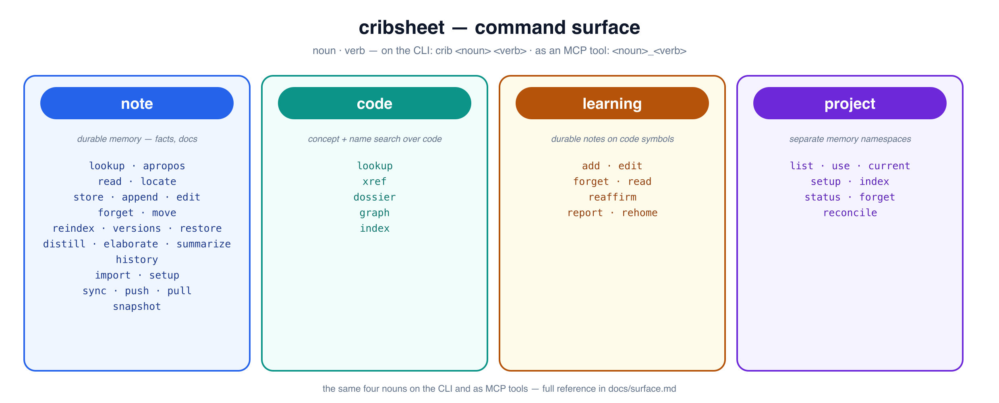

<p align="center">
  
</p>

<h1 align="center">cribsheet</h1>

<p align="center"><em>persistent memory for your AI — plain markdown on disk, semantically indexed</em></p>

Your AI assistant forgets everything between sessions. **cribsheet** gives it a
durable, searchable memory — as plain markdown files you own, not a black box —
that persists across sessions and is shared across every agent and tool you run.

It remembers two kinds of things:

- **Notes** — decisions, conventions, gotchas, hard-won facts. Written as markdown,
  found by meaning (semantic + keyword search), not just exact words.
- **Code** — a symbol index of your repos: every function/class/method with an LLM
  "what it does" description, a real call graph (who calls what), and any durable
  *learnings* you pin to a symbol. It answers the questions `grep` can't — *find
  this by concept*, *what calls this*, *what does this do* — across files.

Disk is the source of truth; the vector index is a derived, rebuildable cache. One
warm process serves your editor (over MCP) and your terminal (`crib <noun> <verb>`) alike.

> `crib` = the command. `cribsheet` = the project. See **[DESIGN.md](DESIGN.md)**
> for the full architecture.

## Why

- **Agents forget. Memory should be durable and shared.** A decision you made last
  week, in another repo, in another tool's session, is one `lookup` away — because
  it's the same markdown tree behind every agent.
- **`grep` can't answer "what does this do" or "what calls this."** The code index
  answers by *intent* and traces the real call graph, so an agent (or you) finds
  code by concept and understands its neighbourhood in one call.
- **It's plain markdown you own.** No proprietary store — edit notes in your own
  editor, diff them in git, sync them across machines. The index rebuilds itself.
- **Built to actually get used.** The hard part of memory isn't storing — it's
  *recall at the right moment*. cribsheet ships the delivery layer: a one-line
  directive that keeps the habit in context, plugins that wire it into Claude Code,
  and an always-warm daemon so a lookup is never the slow path.

## Quickstart

**1 — Install** — cribsheet is on PyPI; `uv` (or `pipx`) puts `crib` on your PATH
with the heavy deps isolated:

```bash
uv pip install cribsheet     # or: uv tool install cribsheet  ·  pipx install cribsheet
```

That's the complete product — store, ONNX embedder (no torch), MCP server + warm
daemon, watcher, and generation (polyllmkit, pulled from PyPI). The one genuine
extra is `[st]`, the torch embedder (host-specific wheels). No submodule dance —
`vendor/llmkit` is only for hacking on llmkit itself.

<details><summary>Dev install (editable venv / uv)</summary>

```bash
python -m venv .venv && . .venv/bin/activate
pip install -e .                        # deps (incl. polyllmkit) from PyPI

uv sync                                 # or: uv pip install -e .

# the torch embedder + llmkit's native LLM adapters (polyllmkit from PyPI):
pip install -e '.[st]' 'polyllmkit[md,bridge,anthropic,google,claude]'

# hacking on llmkit itself: overlay the submodule editable (uv sync restores git)
git submodule update --init && pip install -e ./vendor/llmkit
```
</details>

**2 — Wire it into Claude Code.** One plugin installs the MCP server, the `/crib`
command, and the "reach for memory" directive:

```bash
claude plugin marketplace add georgeharker/cribsheet
claude plugin install cribsheet
```

**The plugin needs nothing installed by hand.** It fetches
[`sharedserver`](https://github.com/georgeharker/sharedserver) (prebuilt — no Rust
toolchain) and `crib` itself on first use if they aren't already present; `curl` and
[`uv`](https://docs.astral.sh/uv/) are the only prerequisites. sharedserver keeps
**one warm crib** serving every session, and it's the same process the CLI attaches to.

Anything you've installed yourself wins: a `crib` or `sharedserver` already on `PATH`
is used as-is, and `$CRIB_BIN` / `$SHAREDSERVER_BIN` are honoured without being
second-guessed. `/crib` goes through the same resolution as the backend, so the CLI and
the MCP server can never disagree about which `crib` they mean.

**On OpenCode?** The counterpart plugin lives in
[`plugins/opencode`](https://github.com/georgeharker/cribsheet/tree/main/plugins/opencode) and does the same three
things (MCP server on `:7732`, `/crib` command, reach-for-crib directive). Add it to
your `opencode.json`:

```json
{ "plugin": ["@geohar/opencode-cribsheet@latest"] }
```

Full options are in the plugin's [README](https://github.com/georgeharker/cribsheet/blob/main/plugins/opencode/README.md); the
`MCP_COMBINER` switch below applies to it too.

**The plugin writes to your user-scope MCP config** (`claude mcp add|remove`) rather
than declaring a server in its manifest — that is what lets one plugin serve both
deployments, and it means crib appears in `claude mcp list` as a user server you can
inspect or remove.

**Already have crib served another way?** If an aggregator such as
[mcp-companion](https://github.com/georgeharker/mcp-companion) already proxies
crib's tools, a second registration would mount every tool twice. Set the switch
**once**, machine-wide, and the plugin registers nothing — you still get `/crib` and
the directive:

```sh
# ~/.zshenv — must be set before Claude Code starts
export MCP_COMBINER=1                    # a combiner serves my MCPs…
export MCP_COMBINER_SERVES_CRIBSHEET=0   # …except crib — per-backend override, wins
```

It's a **global toggle, not per-session**, and it converges both ways: setting it
removes crib's registration, unsetting it restores it. A change lands in the *next*
session. Details: [docs/plugin-mcp-registration.md](docs/plugin-mcp-registration.md).

Prefer to wire it by hand? Copy [`CLAUDE.md.example`](CLAUDE.md.example) into your
global `$CLAUDE_CONFIG_DIR/CLAUDE.md` — that one-line directive is what keeps the
habit in context (tool descriptions alone load too late to form it).

**3 — Use it.** The CLI verbs mirror the MCP tools, so anything Claude does you can
do too:

```bash
# notes
crib note store "Chroma is refcounted by sharedserver." -p notes  # remember a fact
crib note lookup "how is chroma managed" -p notes                 # find it by meaning
crib note apropos "how is chroma managed" -p notes                # hits as full sections

# code — onboard a repo, then ask it questions grep can't answer
cd ~/Development/myrepo
crib project setup                                # index code + docs (one call)
crib code lookup "combine ranked lists"           # find a symbol by CONCEPT
crib code dossier LexicalCache.get                # everything about one symbol
crib code graph reciprocal_rank_fusion            # walk the call graph (pstree)
crib learning add reciprocal_rank_fusion \
     "fuses by RANK, not score — robust to scale differences"   # pin a learning to it
```

That's the loop: **store what's worth keeping, look it up by meaning, onboard a repo
and explore it by concept.** An agent that hits an unindexed repo self-diagnoses
toward `project setup`, runs it, and carries on.

## The surface

Every command reads as **`crib <noun> <verb>`** (and the matching MCP tool
`<noun>_<verb>`) — four nouns for the four facets:



Every capability, its CLI form, its MCP tool, and a one-liner lives in
**[docs/surface.md](docs/surface.md)** — the full reference. Grouped by task:

| | notes | code |
|---|---|---|
| **find** | `note lookup` / `note apropos` (full sections) | `code lookup` (concept ⊕ name), `code dossier`, `code graph`/`xref` |
| **write** | `note store`, `note append`, `note edit`, `note forget`, `note move` | `learning add`/`edit`/`forget` |
| **onboard** | `note import` (files → memory), `note import-memory` | `project setup` / `index` / `status` |
| **housekeeping** | `note reindex`, `project reconcile`, `note versions`, `note restore`, `memory history` | `learning report`, `learning rehome` |

Notes and code share one store, so `lookup` surfaces a repo's docs alongside your
stored knowledge. A repo's `.crib` file ties it to a project and declares which
source and docs to index (docs are indexed **in-situ** — the repo stays the master;
crib holds only the index).

By default a verb attaches to the **warm daemon** (the same process the MCP server
runs), so it's fast; `--no-daemon` runs in-process, `--json` gives machine output.

## Going further

- **Run the MCP server** — the plugin (Quickstart) is the easy path: it registers
  crib and keeps it warm for you. To run it yourself instead: `crib --mcp` (stdio) or
  `crib serve --http --port 7732`, registered as a
  [`sharedserver`](https://github.com/georgeharker/claude-sharedserver)-backed HTTP
  MCP so one warm crib serves every client (and the same process the CLI attaches
  to). Set `MCP_COMBINER=1` (or `MCP_COMBINER_SERVES_CRIBSHEET=1`) when something
  else already serves crib — a combiner, or your own external process — and the
  plugin will stand down rather than register a second copy.
- **Share across machines** — the data dir is a git repo; notes sync via plain git
  with a frontmatter-aware merge driver so provenance never conflicts:
  ```bash
  crib memory sync --remote git@host:notes.git   # first machine: create + push
  crib memory setup --remote git@host:notes.git  # every other: init + merge driver + pull
  crib memory sync                               # thereafter: commit + pull + push
  ```
  Full walkthrough: [docs/resume-on-new-machine.md](docs/resume-on-new-machine.md).
- **Mirror Claude's own memory** — `crib note import-memory` (MCP: `note_import_memory`,
  so an agent can do it too) mirrors Claude Code's harness `memory/*.md` into crib
  (host-namespaced) and live-syncs it, so it's searchable alongside everything else.
- **Configure** — `$XDG_CONFIG_HOME/crib/config.toml` picks the embedder, retrieval
  mode, daemon, and backends; `crib info` prints the resolved paths. The defaults are
  sensible — a minimal override:
  ```toml
  [embed]
  model = "hash"          # or "fe:BAAI/bge-small-en-v1.5" (fastembed), "st:<model>"
  [retrieve]
  hybrid = true           # dense ⊕ BM25, RRF-fused; rerank = true adds a cross-encoder
  [chroma]
  mode = "embedded"       # "embedded" | "shared" (sharedserver) | "json"
  [locations]
  DEV = "~/Development"   # provenance paths stored as $DEV/… so they sync clean
  ```
  Language-server and generation-provider examples:
  [`docs/lsp.json.example`](docs/lsp.json.example),
  [`docs/generate.toml.example`](docs/generate.toml.example).

## How it works

The short version: every write funnels through one idempotent, content-hash-gated
index path under a per-path lock, so races degrade to redundant work, never a wrong
index. Retrieval fuses a dense vector ranking with a warm BM25 lexical ranking
(RRF), with an optional cross-encoder rerank. Embedder and store are both pluggable
(dependency-free defaults for dev). The code index is built live from language
servers (`.lsp.json` specs — ty/pyright, rust-analyzer, gopls, clangd, shuck, …) for
the structural facet and an LLM for the "what it does" descriptions.

The deep dives live in the docs — see **[Documentation](#documentation)** below.

## Documentation

**Using cribsheet**

- **[docs/guide.md](docs/guide.md)** — the user guide: the four facets, the
  noun-verb interface, and five runnable workflows. *Start here.*
- **[docs/surface.md](docs/surface.md)** — the complete CLI ⇄ MCP reference: every
  noun, every verb, one line each.
- **[docs/resume-on-new-machine.md](docs/resume-on-new-machine.md)** — share your
  memory across machines over plain git.

**Under the hood**

- **[DESIGN.md](DESIGN.md)** — the architecture and the *why*, end to end (with the
  hybrid-retrieval pipeline diagram).
- **[docs/implementation.md](docs/implementation.md)** — *how it works today*: a
  subsystem-by-subsystem map anchored to files and symbols (with the
  collaborator-architecture and code-index diagrams). *Start here to work on the code.*
- **[docs/code-symbol-index.md](docs/code-symbol-index.md)** — how the code↔note
  index is built, and the learnings model.
- **[docs/retrieval-and-adoption.md](docs/retrieval-and-adoption.md)** — retrieval
  quality, and why *delivery* (not capability) makes a memory tool get used.
- **[docs/knowledge-capture.md](docs/knowledge-capture.md)** — `distill` /
  `elaborate` / `summarize`, the generation layer over notes.

## Status & tests

The store → index → lookup path, the version ring, the file watcher, git sync, the
code index, and the full CLI + MCP surface all work. The dependency-free fallbacks
(hash embedder, JSON store, `--no-daemon`) are *code properties* that tests and CI
exercise, not install profiles.

```bash
pip install pytest && pytest -q
```
