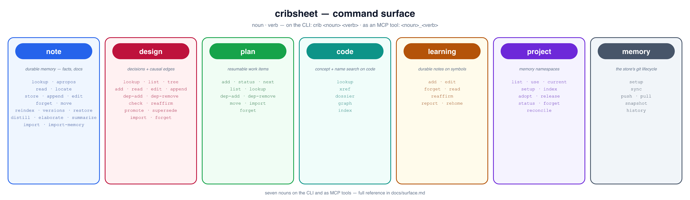

# cribsheet — user guide

**cribsheet** is durable memory for your AI. It stores what's worth remembering as
plain markdown files you own — on disk, in git, editable in your own tools — and
makes it findable by *meaning*, not just exact words. The same memory is shared
across every session, every tool, and every machine you work on, so a decision you
made last week in another repo is one lookup away. You talk to it with the `crib`
command; your AI reaches the same store through its MCP tools.

This guide walks through the concepts and the everyday workflows. For the intro and
install, see the [README](../README.md); for the exhaustive command list, see
[surface.md](surface.md).

## The six things cribsheet manages

- **Notes** — durable facts: conventions, gotchas, hard-won answers.
  You write them as short markdown; cribsheet indexes them so you (or your AI) can
  find them later by describing what you're after, even in different words.
- **Code index** — a searchable map of a repo's code. Every function, class, and
  method gets a plain-language "what it does" description plus a real call graph
  (who calls what). It answers the questions `grep` can't: *find this by concept*,
  *what calls this*, *what does this do* — across files.
- **Learnings** — durable notes attached to a specific code symbol. When you finally
  understand a tricky function, you pin the insight to it; it resurfaces whenever
  anyone looks that symbol up, and survives re-indexing.
- **Design decisions** — settled choices, each declaring the decisions it *rests on*.
  A note can hold the prose of a decision; what it cannot hold is the *promise* —
  and a dep is exactly that: *if that changes, reconsider this.* The graph keeps the
  promise for you: editing a decision names the decisions it just put out of date,
  `crib design check` explains why with the chain, and `crib design reaffirm`
  records that you re-read one and it still holds. That last part matters: taint
  means *a dep moved*, never *you were wrong* — re-reading and reaffirming is the
  cheap, normal ending, which is what makes people willing to record decisions at
  all. A decision can also cite the doc **section** it came from (never the whole
  file), so an edit to that one passage re-checks exactly what was drawn from it
  and an edit anywhere else re-checks nothing.
- **Plans** — work items that outlive the session that wrote them. An in-chat todo
  list dies with the chat and a list in your head dies with the context window; a
  plan item has a status, an order, and must-precede deps, so `crib plan next`
  tells any later session — yours, or a different agent's — what's actionable
  *right now*. The quiet power is in what deps may point at: an item that declares
  the *decision* it implements drops out of `plan next` the moment that decision's
  ground moves — the work stops looking actionable exactly when it stops being
  safe to do, without anyone asking.
- **Projects** — separate memory namespaces. Each repo (or topic) has its own notes,
  code index, learnings, decisions, and plan, so nothing bleeds between contexts. A
  `default` project holds cross-cutting knowledge.

Decisions and plan items live in their own pillar stores (sibling `design/` and
`plans/` dirs — same store machinery as notes, never the same search), and the
facet verbs are the way in: only they speak the dependency edges, and the note
verbs refuse facet paths outright. Which store owns which bytes is
[storage.md](storage.md).

## The interface



Every command reads as **`crib <noun> <verb>`** — a noun for the facet (`note`,
`code`, `learning`, `design`, `plan`, `project`, plus `memory` for the store's git
lifecycle) and a verb for the action:

```bash
crib note store "…"        crib note lookup "…"
crib code lookup "…"       crib code xref some_symbol
crib learning add sym "…"  crib learning read sym
crib design add "…" "…"    crib design check
crib plan add "…"          crib plan next
crib project setup         crib project list
```

That noun-verb shape is the only form — there is no hyphenated `crib code-lookup`.

**Picking a project.** Two selectors work on any command:

- `-p <name>` / `--project <name>` — select by project name.
- `-P <path>` / `--project-path <path>` — select by any path inside the repo (cribsheet
  resolves it to the project).

Code and learning commands act on one *current* project. Set it once with
`crib project use <name>` (or let it be inferred from a path), and later reads need no
selector. **Writes always need an explicit project** — `store`, `append`, `edit`,
`forget`, `move`, and learnings won't silently inherit the current one, so a fact
can't land in the wrong place.

**Two global flags**, placed before the noun:

- `--json` — machine-readable output for any command.
- `--no-daemon` — run in-process instead of attaching to the always-warm background
  process (handy when you've just changed cribsheet itself).

Content-taking verbs (`note store`/`append`/`edit`, `learning add`/`edit`) accept `-`
in place of the text to read it from stdin.

## Common workflows

### 1. Store and recall a note

Remember a durable fact, then find it again by describing it:

```bash
crib note store "Staging deploys need the VPN; prod deploys don't." -p default
crib note lookup "how do I reach staging" -p default      # finds it by meaning
crib note apropos "how do I reach staging" -p default     # same, but full sections
```

`lookup` returns ranked one-line locators; `apropos` returns fewer hits but prints
each matching section in full. To read or revise a specific note:

```bash
crib note read <relpath> -p default        # print its raw markdown
crib note append <relpath> "…" -p default  # add to it
crib note edit <relpath> -p default        # replace its body (or pass - for stdin)
```

Every write is versioned — `crib note versions <relpath>` lists recoverable prior
versions and `crib note restore <relpath> <v>` rolls back. A deleted note
(`crib note forget`) is recoverable too.

### 2. Onboard a repo and search its code

Point cribsheet at a repo once, then ask it questions grep can't answer:

```bash
cd ~/Development/myrepo
crib project setup                          # index code + docs in one call
crib project status                         # confirm: symbol/file counts

crib code lookup "combine two ranked lists" # find a symbol by CONCEPT
crib code dossier reciprocal_rank_fusion    # signature + description + neighbours
crib code xref reciprocal_rank_fusion       # its callers, callees, references
crib code graph reciprocal_rank_fusion      # the call graph as a pstree
```

`project setup` is the full onboard (docs + code). If you only want the code index
re-run after changes, `crib project index` is the cheap, hash-gated repeat. An AI
agent that hits an unindexed repo self-diagnoses toward `project setup` on its own.

### 3. Attach and recall a learning on a symbol

When you work out what a confusing function really does, pin it so the insight is
there next time — for you or the AI:

```bash
crib learning add reciprocal_rank_fusion \
  "Fuses by RANK, not score — robust to scale differences between the two rankers."
crib learning read reciprocal_rank_fusion   # print it back
crib learning report                        # health of all learnings: ok/moved/orphan
```

Learnings survive re-indexing and resurface automatically in `code lookup`, `code
xref`, and `code dossier`. If code moves and a learning is orphaned, `crib learning
rehome <old> [new]` re-points it (with no target it suggests ranked candidates).

### 4. Record a decision and let the graph guard it

When a design question gets settled, record it *with what it builds on*:

```bash
crib design add "Disk is truth, Chroma is a rebuildable cache" \
  "Every write lands on disk first; the index is derived and safe to drop." -p myrepo

crib design add "Content-hash gating is the only write/watcher coordination" \
  "One idempotent, hash-gated index path under a per-path lock." \
  --dep "Disk is truth, Chroma is a rebuildable cache" -p myrepo
```

That `--dep` is a promise: *if that changes, reconsider this.* So when the ground
moves — an edit through the facet, a raw `note edit`, even a git pull —

```bash
crib design edit "Disk is truth, Chroma is a rebuildable cache" -p myrepo
```

— the edit answers with what it just tainted, and `check` says so again later, with
the chain and the change kind that explain it:

```bash
crib design check -p myrepo                                   # the re-read queue
crib design read "Content-hash gating is the only write/watcher coordination" -p myrepo
crib design tree "Disk is truth, Chroma is a rebuildable cache" --dependents -p myrepo
```

`read` is the one-call orientation: body, what it builds on, what builds on it,
citations, and its own taint. Re-reading and finding it still holds is the *normal*
ending — taint means *a dep moved*, not *you were wrong*:

```bash
crib design reaffirm "Content-hash gating is the only write/watcher coordination" -p myrepo
```

You don't have to remember to check: `crib status` carries a per-project tainted
count, and any lookup that lands on a stale decision says so on the hit. To pull
decisions out of a doc you already have, `crib design import DESIGN.md` returns its
citable sections and the extraction procedure — extracted entries land `proposed`
until `crib design promote` blesses them. When a decision genuinely no longer holds,
`crib design supersede` retires it and taints what built on it.

Two later-life conveniences. Decisions are usually written *before* the doc of
record grows around them — so `crib design append <ref> "…" --source "DESIGN.md#7a"`
wires a citation in **after the fact** (added, deduped; existing citations keep the
hash they were captured at). And the whole decision map exports as a diagram-ready
graph:

```bash
crib design graph -p myrepo        # {nodes, edges}: dep + superseded_by edges,
                                   # every node titled and taint-flagged
```

Same shape as `crib code graph --edges`, so one renderer draws both.

### 5. Plan work that outlives the session

Anywhere you'd write a todo list, write it into the plan instead — one call takes
the batch:

```bash
crib plan add "Add the section-hash column" -p myrepo \
  --item "Backfill hashes for existing citations" \
  --item "Report changed sources in plan list"

crib plan dep-add "Backfill hashes for existing citations" \
                  "Add the section-hash column" -p myrepo   # must follow it
```

A later session — days later, or a different agent — picks it up cold:

```bash
crib plan next -p myrepo     # what's actionable NOW: nothing blocks these
crib plan status "Add the section-hash column" in-progress -p myrepo
crib plan status "Add the section-hash column" done -p myrepo   # answers: unblocked …
crib plan list -p myrepo     # in-progress, then ready, then blocked (naming what it waits on)
```

Marking an item `done` reports the items its completion just freed. `in-progress` is a
*claim* — it takes the item out of everyone else's `plan next`. Deps may also point at a
design decision, which blocks while that decision is tainted or still `proposed`:
unstable ground is not something to build on.

Two different things can go stale about an item, and they have two different verbs
because they are two different *claims*:

```bash
crib plan status <ref> done -p myrepo      # a claim about the WORK: it happened
crib plan reaffirm <ref> -p myrepo         # a claim about the GROUND: the decision
                                           # this rests on moved; I re-read it; the
                                           # item still stands — re-record the baseline
```

Without `reaffirm`, an item whose underlying decision was edited keeps a ⚠︎ stale
marker in lookups even though nothing is wrong — and clearing it should never
require pretending the work moved. The plan also exports as a graph, *including*
the decisions items rest on (those edges gate, so a plan drawn without them would
look self-contained when it isn't):

```bash
crib plan graph -p myrepo          # {nodes, edges}: plan items + the design
                                   # nodes they rest on, dep edges typed
```

### 6. Share memory across machines

Notes live in a git repo, so they sync with plain git plus a merge driver that keeps
provenance from ever conflicting:

```bash
crib memory sync --remote git@host:notes.git   # first machine: create + push
crib memory setup --remote git@host:notes.git  # every other machine: init + pull
crib memory sync                               # thereafter: commit + pull + push
```

`crib memory push` and `crib memory pull` are the halves of `sync` (pull reindexes after).
The code index and other derived data are regenerable, so they aren't synced — you
rebuild them locally with `crib project reconcile` (sweeps every project for changes).
A full new-machine runbook is in
[resume-on-new-machine.md](resume-on-new-machine.md).

### 7. Reach the same memory from your AI

Everything above is available to an AI agent through cribsheet's MCP tools, whose
names mirror the CLI: `note_lookup`, `note_store`, `code_lookup`, `code_dossier`,
`learning_add`, `design_add`, `design_check`, `plan_add`, `plan_next`,
`project_setup`, and so on. So when your agent looks something up or
onboards a repo, it's reading and writing the *same* markdown tree you use from the
terminal — one shared memory behind both. Wiring it into Claude Code is a plugin
install; see the [README](../README.md#quickstart).

## Where to go next

- [README](../README.md) — the intro, install, and quickstart.
- [decisions-and-plans.md](decisions-and-plans.md) — the design/plan facets in
  depth: why a graph and not notes, how staleness is computed, the two claims,
  the import quarantine, and the graph exports.
- [surface.md](surface.md) — the complete CLI + MCP reference (every verb and tool),
  including the full design/plan verb tables and how the two edge families check.
- [storage.md](storage.md) — where each kind of content lives, who owns the bytes,
  and which verbs may write them.
- [resume-on-new-machine.md](resume-on-new-machine.md) — standing memory up on a new box.
