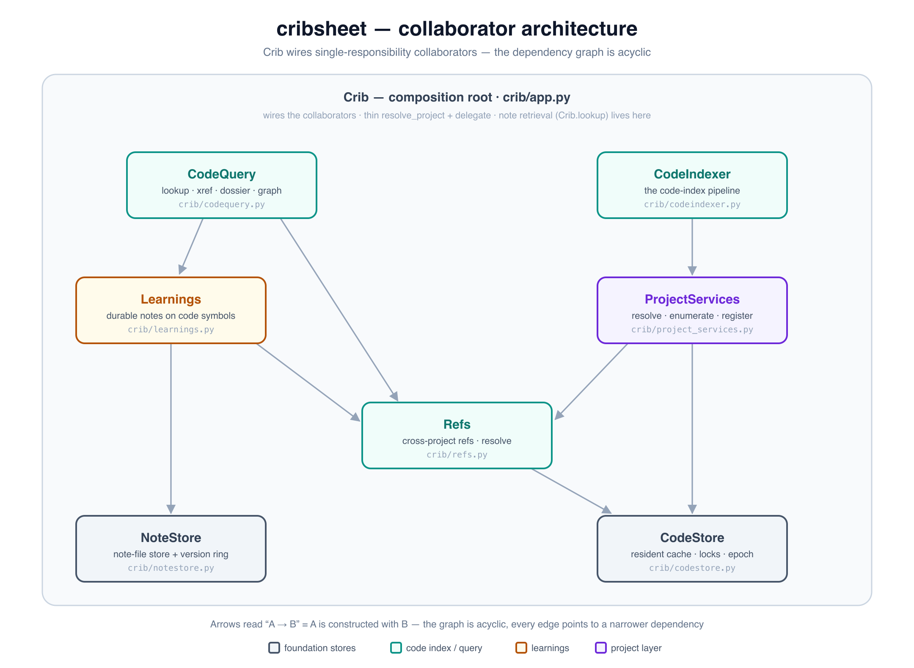

# Implementation map — how the parts actually work

A subsystem-by-subsystem tour of the code as it stands (2026-07), anchored to
files and symbols so you can jump straight in. [DESIGN.md](../DESIGN.md) is the
architecture and the *why*; this is the *how it works today*, written by walking
the code with crib's own index. The [mess ledger](#mess-ledger--cleanup-candidates)
at the end collects what we found that deserves a cleanup round.

## 0. The shape — `Crib` as composition root

Source: [`collaborator-architecture.svg`](images/collaborator-architecture.svg) (authored with svg-mcp; the PNG is a 2× render).

`Crib` (`crib/app.py`) no longer *is* the system; it *wires* it. `Crib.__init__`
instantiates a set of single-responsibility collaborators and holds them, and its
public methods are thin `resolve_project` + delegate wrappers. The collaborators
form an **acyclic** dependency graph — each takes only the narrow deps it needs,
with no back-reference to the whole `Crib`:

- **`NoteStore`** (`crib/notestore.py`) — the note-file store: path resolution
  (`dir`/`abspath`/`source_roots`), `read`/`write`/`delete`/`move`/`reindex`, and
  the version ring (`list_versions`/`version_content`).
- **`CodeStore`** (`crib/codestore.py`) — the code subsystem's shared state: the
  in-memory resident cache (`_ResidentCode`), per-project locks, the freshness
  epoch, and the primitives (`resident`/`reload`/`revalidate`/`dir_sig`/`tok`/
  `bump_epoch`).
- **`CodeIndexer`** (`crib/codeindexer.py`) — the code-index *pipeline*
  (`code_index`/`_index_project_code`/`_index_code_file[_tracked]`), driven by
  `ProjectServices`.
- **`CodeQuery`** (`crib/codequery.py`) — the code-index *queries*
  (`lookup`/`xref`/`dossier`/`graph`), over `Refs` + `Learnings` + the embedder.
- **`Refs`** (`crib/refs.py`) — cross-project references (`project_refs`,
  `ref_edge_ctx`, `resolve_symbol`/`resolve_symbol_or_ref`).
- **`Learnings`** (`crib/learnings.py`) — durable notes attached to code symbols
  (`attach`/`report`/`rehome`/`read`, + append/edit/forget/reaffirm).
- **`ProjectServices`** (`crib/project_services.py`) — the project layer
  (`resolve_project`, `enumerate_code_files`, `register_code_root`); narrow deps
  (refs + code + paths + config), no whole-`Crib` back-reference.

The `__init__` wiring order *is* the DAG: `CodeStore` and `NoteStore` first, then
`Refs` (needs the resident cache), then `ProjectServices` (refs + code) →
`CodeIndexer` (services), and `Learnings` (refs + notestore) → `CodeQuery`
(refs + learnings + embedder). Note *retrieval* (`Crib.lookup`) deliberately stays
on `Crib` — it spans the note store and the embedder and isn't a code-index query.
The whole split was made behavior-preserving and *proven* so: each extraction step
was gated by `scripts/snapshot_harness.py` against a frozen symbol-index golden and
had to reproduce it byte-for-byte (see `tests/goldens/`, `tests/test_corpus_goldens.py`).

## 1. Notes ingestion (store → chunks → index)

Every write funnels through one path:

- **Write**: `NoteStore.write` (`crib/notestore.py`, reached via `Crib`'s thin
  `store`/`append`/`edit` wrappers) stashes the prior content to the version ring,
  writes the new file atomically, and triggers reindexing.
- **Index**: `IndexEngine.index_file` (`crib/indexer.py`) takes a per-path lock
  and delegates to the locked inner routine — concurrent callers for the same
  note serialize; races degrade to redundant work, never a wrong index.
- **Chunk**: `chunk_note` (`crib/chunk.py`) splits the body into per-heading
  sections, windowing any section over the word limit (overlapping windows).
  Each `Chunk.content_hash` covers heading + body, so the per-chunk gate
  re-embeds only what changed.
- **Line spans**: `section_line_map` (`crib/chunk.py`) recomputes heading→line
  spans at *query* time, so `lookup` hits carry accurate line numbers even
  after edits.

Callers of `index_file` are the complete ingestion fan-in: note CRUD
(`store/append/edit/forget/move`), the notes watcher (`_on_fs_change`), in-situ
docs (`index_docs_insitu`), the Claude-memory mirror (`import_claude_memory` /
`_reconcile_memory_dir`), learnings (`code_rehome`), and `reindex`/reconcile.

## 2. Two note classes, one index

- **Crib-owned** notes live under `<project>/notes/` in the data dir: editable,
  git-synced, versioned. `import` copies named files in (provenance stamped,
  id preserved across re-imports; paths anchor to the caller — CLI cwd or MCP
  `project_path`).
- **Source-owned** docs are indexed **in-situ**: the repo's `.crib` `docs:`
  globs are swept by `index_docs_insitu`; `SourceRoots` (`crib/sources.py`,
  `doc-sources.json`) records repo→root so `read`/`locate` return the *repo*
  path. The source watcher reindexes them on save — and filters by the SAME
  `docs:` globs the sweep honors (`_matches_doc_globs`), so which docs get indexed
  no longer depends on how the change arrived; the sweep's prune drops anything
  under the prefix the globs don't match, making `docs:` authoritative.

## 3. Retrieval (notes)

`Crib.lookup` (`crib/app.py` — note retrieval stays on `Crib`, §0) → `_retrieve`: dense cosine over chunk
embeddings ⊕ BM25 (warm lexical cache, `crib/retrieve.py`) ⊕ optional
summary-alias dense ranking, RRF-fused, optional cross-encoder rerank (a third
*voter* fused in, never a unilateral reorderer). `apropos` is the same ranking
returning full section markdown sliced from disk by line span. The
`keyword_index`/`summary_index` label sets (built by `elaborate`/`summarize`)
fold in via config or per-call overrides.

## 4. Code indexing pipeline

`crib project setup` / `crib project index` → `CodeIndexer._index_project_code`
(`crib/codeindexer.py`, driven by `ProjectServices`):

1. **Enumerate** (`_enumerate_code_files`): extension globs + grammar-routed
   extensionless files (shebang / `#compdef` / `#autoload` / bare names, via
   `content_lang`). Subtrees carrying their own `.crib` are project
   *boundaries* (`_nested_project_roots`) — vendored checkouts belong to their
   own project, reached via `refs:`.
2. **Pin** (LSP membership): servers whose spec sets `pinWorkspace` get the
   full doc set didOpen'd (`LspSessionPool.pin_docs`) for the sweep — an open
   doc is in the server's analysis set even when its own discovery would miss
   it. Released in the sweep's `finally`.
3. **Per file** — `_index_code_file_tracked` (the tracked wrapper: registers
   in-flight state for `status`) → `_index_code_file`:
   - skip guards: in-tree ref checkouts, nested projects;
   - `extract_file` (`crib/codeindex.py`) — structural facet via the warm LSP
     session (below): one `documentSymbol` pass, callHierarchy + references per
     symbol, edges located by `_locate` (workspace rel, ref-qualified
     `proj:rel`, or dropped);
   - integrity guards: **keep-prior-on-empty** (a non-trivial file extracting
     to zero symbols is a flaky pass, not an emptying) and the
     **partial-extract guard** (strictly fewer symbols and nothing new =
     suspected mid-settle partial → one slow confirming re-extract before any
     deletion is trusted);
   - **describe** (semantic facet): whole-file bulk LLM call (`describe_file`)
     for stale symbols only (per-symbol `content_hash` gate), focused
     `describe_symbols` mop-up for bulk misses. Generation failure never loses
     the structural facet.
   - **write**: under the per-project lock — `SymbolIndex.write_all` (one
     legible TOML per symbol, filename = slugged fqn), vanished-symbol drop,
     `_patch_called_by` (single-file reindexes keep the cross-file graph
     consistent; sweeps skip it, the LSP hands each file its edges), epoch bump.
4. **Progress**: `_sweeps` {done,total} per project — the poll-able wait signal
   in `status`; gone when the sweep finishes.

The **resident code cache** lives on `CodeStore` (`crib/codestore.py`):
`_ResidentCode` + `resident`/`reload` keep parsed symbols + description embeddings
in memory; freshness is either `scan` (dir signature, `dir_sig`) or `trust`
(in-process epoch, `bump_epoch`). `CodeStore.revalidate` is the lazy query-time
staleness gate: source mtime vs the toml's own mtime, plus force-reindex of
merge-dirtied files (blank `content_hash` from the sync merge driver). `CodeStore`
also owns the per-project locks the pipeline and queries coordinate on.

## 5. Warm LSP sessions (`LspSessionPool`, `crib/codeindex.py`)

One initialized server per (workspace root, server label): spawn + `initialize`
(the whole-workspace index — the expensive part) paid once, not per file.

- **Readiness**: the client advertises `window.workDoneProgress`, tracks
  `$/progress` begin/end tokens, and `wait_quiescent` waits on the server's own
  busy signal (bounded) instead of a guessed settle.
- **Doc lifecycle**: per-extraction didOpen → query → didClose (disk stays the
  truth; self-healing), EXCEPT sweep pins — and an open doc's truth is the
  client's, so extracting a pinned uri didChanges the current text.
- **Currency**: servers self-watch the fs AND the code watcher pumps
  `workspace/didChangeWatchedFiles` into every warm session for the changed
  root (`notify_changes`).
- **Multi-root**: ref projects' out-of-tree local roots ride as extra
  `workspaceFolders` at session creation (inbound cross-project references,
  where the server supports it — pyright yes, shuck no).
- **Supervision**: dead servers are `poll()`-detected and respawned; a wedged
  extraction discards the session and retries once; idle sessions grace-reap;
  `close_all` on daemon shutdown/atexit.

## 6. Watchers (`crib/watch.py`)

Shared plumbing (`_FSWatcher`: observer lifecycle, handler, debounce) with two
subclasses:

- **Notes watcher**: per-file debounce → `_on_fs_change` → `index_file`.
- **CodeWatcher**: registered per source root as projects get indexed; decodes
  events (extension map, doc extensions, and content-grammar routing for
  extensionless files), coalesces a burst into ONE per-project batch, and
  dispatches `_on_code_change`: pump to LSP sessions → per-file reindex / drop,
  or a whole-project `_revalidate` for oversized batches (branch switch).

Two hard-won integrity rules live here: a **delete flag is never trusted** —
verified against the file's actual state at decode AND at dispatch (macOS
FSEvents coalesces rename-style saves into flag bundles that watchdog re-expands
in arbitrary order; trusting last-event-wins evicted whole files' symbols) — and
deletion by LSP say-so requires a confirming slow re-extract (§4).

## 7. Cross-project refs

`.crib` `refs:` names other projects (names only — each machine resolves a ref
to its local checkout via the ref's machine-local `.source_root`;
`Refs.project_refs`, `crib/refs.py`). Three mechanisms compose:

- **Query fan-out**: `CodeQuery.lookup` (`crib/codequery.py`) merges per-project
  rankings (equal-weight RRF, local-first tie-break); `Refs.resolve_symbol_or_ref`
  falls through to refs for dossier/xref/graph; dossier/graph traverse qualified
  edges and annotate from the ref's index.
- **Edge attribution** (`_locate`): out-of-root LSP resolutions attribute to a
  ref via its local root, an in-tree vendored checkout carrying the ref's
  `.crib` (checked before the workspace — same repo, same rel paths), or a
  site-packages suffix match. Qualified edges key by (name, file), sidestepping
  path-derived fqname differences between checkouts.
- **Boundaries**: nested `.crib` dirs are excluded from the parent's
  enumeration and single-file indexing.

## 8. Learnings

The `Learnings` collaborator (`crib/learnings.py`) owns them. A learning is a
first-class NOTE under `<project>/notes/code-learnings/`, keyed by slugged fqn —
deliberately separate from the regenerable LLM description. `Learnings.attach`
enriches query results O(1) by slug; staleness = the symbol's `content_hash`
moved since authoring (a heads-up, not an invalidation). `Learnings.report`/
`rehome` (surfaced as `crib learning report`/`crib learning rehome`) audit and
re-point orphans.

## 9. Git sync & merge

`GitBacking` (`crib/gitbacking.py`) over the data dir: snapshot/history local;
setup/sync/pull/push share notes. Joining a populated remote never seeds our
own `.gitignore`/`.gitattributes` over the branch's (`_pending_join` +
`_remote_file`: the shared files are seeded FROM the fetched branch, since
`.gitattributes` must exist before the join merge it routes). The `cribnote`
merge driver (`crib/merge.py`) resolves note frontmatter deterministically and
symmetrically (both machines converge), surfaces real body conflicts, and for
symbol TOMLs auto-resolves field-wise — EXCEPT when the two sides indexed
different code states (content_hash disagrees): then the merged record is
blank-hashed (dirty) and each machine rebuilds it from its own checkout
(`_revalidate` force-reindex + post-pull `_reindex_dirty_code`, concurrent).

## 10. Daemon & surfaces

The MCP server (`crib/server.py:build_server`) is the daemon; the CLI is an MCP
client of it (`crib/client.py`, sharedserver-managed). The CLI surface is
**noun-verb**: `crib <noun> <verb>` (`note`/`code`/`learning`/`project`, plus flat
`serve`/`info`/`status`), nested argparse subparsers whose MCP counterparts are the
flat `@mcp.tool()` names (`note_lookup`, `code_xref`, `learning_add`, `project_list`,
…). One `VERBS` registry (`crib/cli.py`) maps each nested verb to its MCP tool + Crib
method + emitter; `_run_daemon`/`_run_inprocess` are the two ~12-line dispatchers over
it. `--no-daemon` runs in-process. Writes require an
explicit project (schema-level `anyOf` via the `write_tool` decorator;
elicitation when omitted); reads ride the sticky per-connection session project
(DESIGN §15). `status` is the one-call health summary (inventory, git state,
LSP sessions, in-flight indexing, sweep progress).

---

## Mess ledger — cleanup candidates

Found while writing this map; none are bugs, all are friction.

1. **~~`crib/app.py` is a 2,500-line god object.~~ ✓ Resolved (2026-07-08).**
   Split into single-responsibility collaborators wired by `Crib` as a composition
   root (§0): `NoteStore`, `CodeStore`, `CodeIndexer`, `CodeQuery`, `Refs`,
   `Learnings`, `ProjectServices`. `app.py` dropped ~2,547 → ~1,530 lines; its
   public methods are thin `resolve_project` + delegate wrappers, the collaborator
   DAG is acyclic (narrow deps — `ProjectServices` and the rest take only what they
   need, no whole-`Crib` back-reference), and all 11 extraction steps were gated
   byte-identical against a frozen symbol-index golden (`scripts/snapshot_harness.py`,
   `tests/goldens/`, `tests/test_corpus_goldens.py`). Note retrieval (`Crib.lookup`)
   intentionally stayed on `Crib`.
2. **~~Two CLI dispatch tables.~~ ✓ Resolved (2026-07-07).** The daemon
   arg-mapper (`_verb_call`), the in-process dispatcher (`_run_inprocess`), and
   the emitter switch collapsed into one `VERBS` registry (`crib/cli.py`): one
   `Verb` row per verb (tool name + arg-builder + emitter + method/async/cwd
   flags), and two ~12-line dispatchers (`_run_daemon`/`_run_inprocess`) that
   differ only in `project_path`-str-vs-`cwd`-Path and sync-vs-`asyncio.run`.
   Adding a verb is now one row. (Folds in #8.)
3. **~~`extract_file`/`_extract` is ~150 lines.~~ ✓ Resolved (2026-07-07).** Split
   by concern: `_extract` is now a lifecycle skeleton (acquire → open/sync doc →
   quiescence → walk → teardown); the ~65-line loop body became `_symbol_entry`
   (one documentSymbol node → one record, or None if filtered), sharing per-file
   invariants via an `_ExtractCtx`; the reference loop became `_reference_edges`,
   symmetric with the `_hierarchy_edges` callHierarchy collector. `opened`/`sym_cache`
   stay single objects through the ctx so the "close only what THIS call opened,
   keep the pins" teardown is byte-for-byte unchanged.
4. **~~`elaborate`/`summarize` are near-duplicates.~~ ✓ Resolved (2026-07-07).**
   Dispatch is deduped by the #2 registry; the CLI parser's two identical blocks
   collapsed to one loop. The remaining two surfaces (the `@mcp.tool()` pair and
   the `Crib.elaborate`/`summarize` methods) are *intentionally* distinct — each
   is a thin wrapper over `_generate_index` whose user-facing docstring carries
   the real keyword_index-vs-summary_index distinction; merging them would hurt
   the tool/method surface, not help it.
5. **~~Doc-glob asymmetry.~~ ✓ Resolved (2026-07-07).** The watcher now filters
   doc-extension events by the project's `.crib` `docs:` globs (`_matches_doc_globs`,
   `full_match` mirroring the sweep's `Path.glob` — hence the py3.13 floor), so it
   and the sweep agree on which prose is a doc regardless of arrival. The sweep's
   prune is authoritative too: `index_docs_insitu` now `forget`s (index-only drop)
   anything under the prefix the globs no longer match — cleaning up docs that
   leaked in before the filter — rather than re-indexing on-disk stragglers.
6. **~~`code_indexed_projects` defensive shape-check.~~ ✓ Resolved (2026-07-07).**
   The dead `isinstance(p, dict)` branch is gone — `projects()` returns
   `list[str]`, so the loop iterates names directly.
7. **~~Session project state vs write-elicitation.~~ ✓ Resolved (2026-07-07).**
   The read policy now flows through a `ProjectResolution` (`crib/session.py`:
   project + how it resolved — `explicit`/`path`/`session`/`seed`), with the three
   policies documented together as one block above the `server.py` helpers
   (`_resolve`/`_project` = reads, `_source_project` = repo-scoped, `_write_project`
   = must-name). This also fixed the real bug behind it — the combiner-global sticky
   leak (config `isolate: true`, matching svg-mcp) — with the read code tools now
   *echoing* an implicit resolution so a wrong one is visible. See
   [todos.md](../todos.md) "Resolved → Sticky session project".
8. **~~`_RAW_PRINT` + per-verb emitter if-chain in `cli.py`.~~ ✓ Resolved
   (2026-07-07).** Folded into #2: each `Verb` carries its own `emit` callback,
   so the emitter switch and the `_RAW_PRINT` set are gone (raw-print verbs just
   use a `print` emitter).
9. **~~Naming: three "index file" spellings.~~ ✓ Resolved (2026-07-07).** The
   code-index pair renamed to `_index_code_file_tracked` (the tracked wrapper)
   and `_index_code_file` (the work), so neither collides with the notes
   pipeline's `IndexEngine.index_file`.
10. **Git sync/sharing has no home collaborator.** `setup`/`sync`/`push`/`pull`/
    `snapshot` are app-level plumbing over `GitBacking` (`crib/gitbacking.py`),
    not a first-class subsystem — the one area the noun-verb interface cleanup
    (2026-07-08) could *not* map cleanly to a collaborator (it folded them under
    the `note` noun as `crib note sync`/`push`/`pull`/… since they operate on the
    note repo). Candidate seam: a `NoteRepo`/`Sync` collaborator owning the git
    lifecycle, so the interface and the factoring line up. Low priority — the
    surface reads fine as-is.
